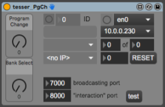

This Patch is part of the [TESSER environment](https://bitbucket.org/AdrianArtacho/tesserakt/src/master/).

# Tesser_PgCh

This README would normally document whatever steps are necessary to get your application up and running.

### What is this repository for?

* Quick summary
* Version
* [Learn Markdown](https://bitbucket.org/tutorials/markdowndemo)

___

# To-Do

* change Molekular programs from tablet
* button to turn on inscore from the patch
* 
